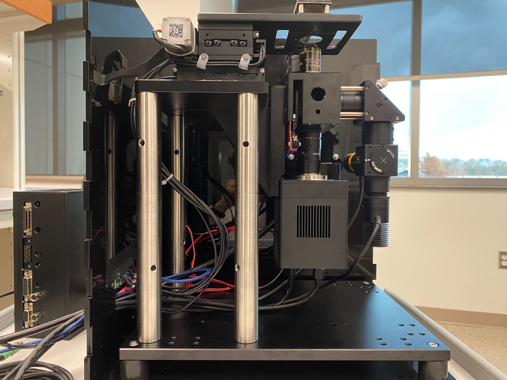

# IncuTEC

IncuTEC is a custom microscope incubator that uses a thermoelectric
(Peltier) heating and cooling system with CO₂ control. It is designed for
the [SQUID microscope](https://github.com/wenzel-lab/SQUID-bioimaging-platform)
and other optical instruments with a similar footprint.

## Documentation

### Start here

| Document | What it contains |
| --- | --- |
| [Assembly guide](assembly-guide.md) | Illustrated, step-by-step enclosure assembly instructions |
| [Bilingual assembly instructions (Word)](docs/incutec-assembly-instructions-bilingual.docx) | Spanish and English assembly instructions in a downloadable document |
| [Pneumatic system diagram](docs/incutec-pneumatic-system-diagram.pdf) | CO₂ tank, regulator, valves, gauges, and incubator connections |
| [UIM V2 user manual (English)](docs/uim-v2-user-manual-en.pdf) | Operation and configuration of the temperature controller display |
| [Temperature control module FAQ (English)](docs/tcm-temperature-control-module-faq-en.pdf) | Initial configuration and troubleshooting for the TCM controller |
| [UIM display module notes](docs/uim-display-module-notes.md) | Project-specific notes about language and maximum output voltage |

### Temperature-control references

- [TCM temperature control module overview (English)](docs/tcm-temperature-control-module-overview-en.pdf)
- [UIM universal display module overview (English)](docs/uim-universal-display-module-overview-en.pdf)
- [TCM parallel operation application note (English)](docs/tcm-parallel-operation-application-note-en.pdf)
- [Alternate translation of the TCM parallel operation application note](docs/tcm-parallel-operation-application-note-en-alternate.pdf)
- [Laird: heating and cooling of incubator chambers (2020)](docs/laird-incubator-heating-cooling-application-note-2020.pdf)
- [Laird SAA-170-24-22 thermoelectric cooler datasheet](docs/laird-saa-170-24-22-tec-datasheet.pdf)

### Sensor datasheets

- [Sensirion SCD30 CO₂, humidity, and temperature sensor](docs/SensorDatasheets/sensirion-scd30-co2-sensor-datasheet.pdf)
- [Winsen ME2-O2 oxygen sensor](docs/SensorDatasheets/winsen-me2-o2-sensor-manual.pdf)
- [Seeed Grove SHT35 temperature and humidity sensor](docs/SensorDatasheets/seeed-grove-sht35-temperature-humidity-sensor-datasheet.pdf)
- [Seeed Grove MQ2 gas sensor](docs/SensorDatasheets/seeed-grove-mq2-gas-sensor-datasheet.pdf)
- [Seeed Grove light sensor v1.2](docs/SensorDatasheets/seeed-grove-light-sensor-v1.2-datasheet.pdf)
- [Seeed Grove real-time clock](docs/SensorDatasheets/seeed-grove-rtc-user-manual.pdf)

## Wenzel Lab operating guide

> [!CAUTION]
> CO₂ can displace oxygen. Use the incubator only in a properly ventilated
> space, secure the gas cylinder, and follow your institution's compressed-gas
> safety procedures.

### Start-up

1. Check that the pneumatic connections are secure and that the run/vent valve
   on the incubator is in the correct position.
2. Switch on the mains power at the back of the controller. The Raman laser
   driver is powered by the same controller/power supply.
3. Set the target temperature and switch temperature control on using the UIM
   display (the white box with the round button).
4. Open the main valve on the CO₂ cylinder.
5. Move the gas-control slider on the controller to **HIGH**. The target CO₂
   percentage can currently be changed only in the microcontroller settings
   over USB.
6. Monitor temperature and CO₂ until both readings are stable before beginning
   an experiment.

### Shut-down

1. Close the main valve on the CO₂ cylinder; the regulator does not need to be
   adjusted.
2. Vent the remaining CO₂ using the run/vent valve near the incubator inlet.
3. Move the gas-control slider to **LOW**.
4. Switch temperature control off using the UIM display.
5. Turn off the main power-supply switch.

## Project resources

- [3D models](3DModels/)
- [Control electronics, code, and schematics](control/)
- [Assembly images](images/AssemblyImages/)
- [SQUID inverted microscope enclosure example](https://forum.squid-imaging.org/t/assembly-guide-for-inverted-system-with-the-60-mm-x-60-mm-stage/51)

## Design overview

The chamber consists of two self-sealing parts: a bottom section that
accommodates the microscope feet and cables, and a removable top section that
seals against the base. The target operating range is approximately 4–40 °C,
with 37 °C as the typical setpoint. The current gas system adds CO₂ to ambient
air for mammalian cell culture and microaerobic applications; the design is
intended to remain extensible toward anaerobic operation.

The temperature-control assembly is inspired by incubator designs from the
Prakash Lab and adapted for additional uses and gas control.

## Bill of materials highlights

- [Yexian TCM Standard temperature controller](http://yexian.com/product/tcm_standard.htm)
  with PID auto-tuning
- [Laird SAA-170-24-22 air-to-air thermoelectric cooler](https://www.mouser.cl/ProductDetail/Laird-Thermal-Systems/387000612?qs=uwxL4vQweFP51dqtRIyGCw%3D%3D)
- Acrylic sheet or rigid insulating foam for the enclosure

## Open items

- Characterize the temperature ramp speed for 12 V and 24 V controller supply
  configurations.
- Validate the achievable CO₂ control range around the 5% setpoint.
- Install an independent room CO₂ monitor.
