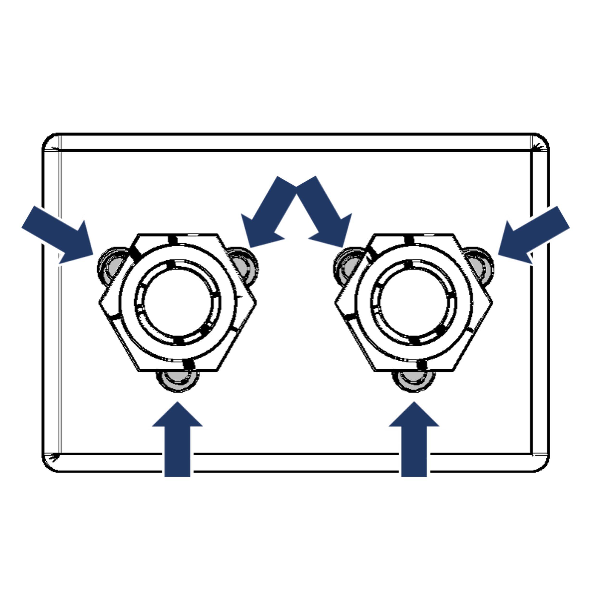

[M4x10 screws]:Parts.yaml#M4x10PanSteel
[No. 2 Phillips screwdriver]:Parts.yaml#Screwdriver_Philips_No2
# Assembly Instructions

{{BOM}}

## Gluing and sealing walls {pagestep}

Position the plates accordingly, ensuring a 90° angle between them.Using the syringe, inject the
adhesive liquid between the plates you want to join, waiting for it to bond before moving on to the next plate. Once all the plates
are bonded, use a rod to add the previously diluted acrylic to each of the joints. Ensure that the mixture covers each section of the
joints to prevent leaks.

## Preparation of the screw cubes {pagestep}
Place the nuts in the hexagonal holes according to the hole dimensions. Using a syringe,
inject resin into the three notches for each nut. Apply UV light to cure the resin and secure the nuts in place.

>! Be careful that the resin applied is only injected into the indicated notches. Avoid using excess resin that could affect the nut thread.
>!
>! 

## Gluing the screw cubes {pagestep}
Apply glue suitable for gluing screw cubes to acrylic walls (such as cyanoacrylate). Cover the contact surface so that the product does not affect the nuts. Position the block in the correct place, applying pressure while gluing it properly.

>i  dw

>!! dd
